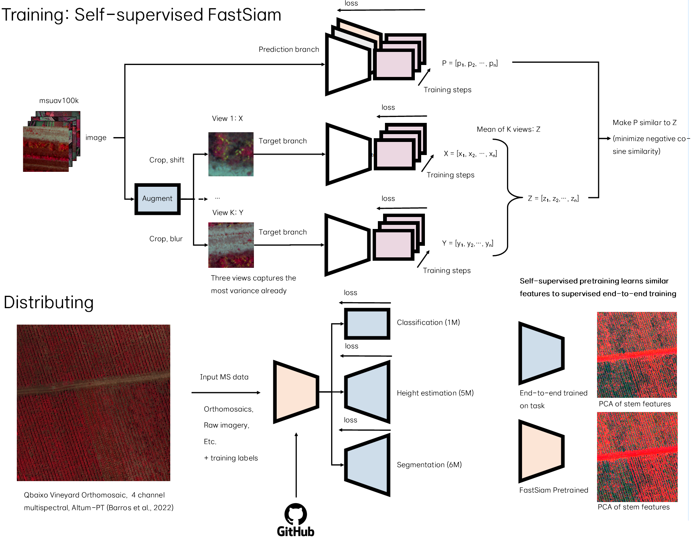
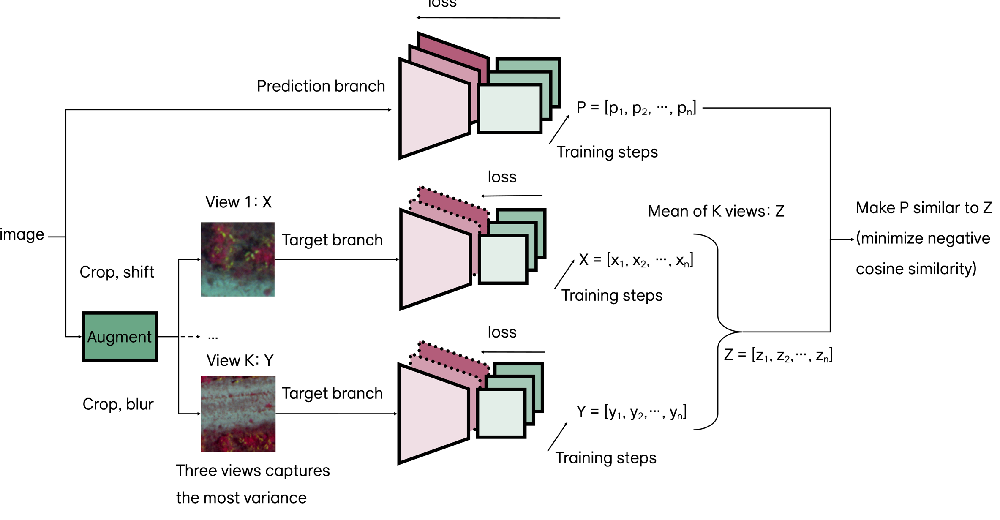
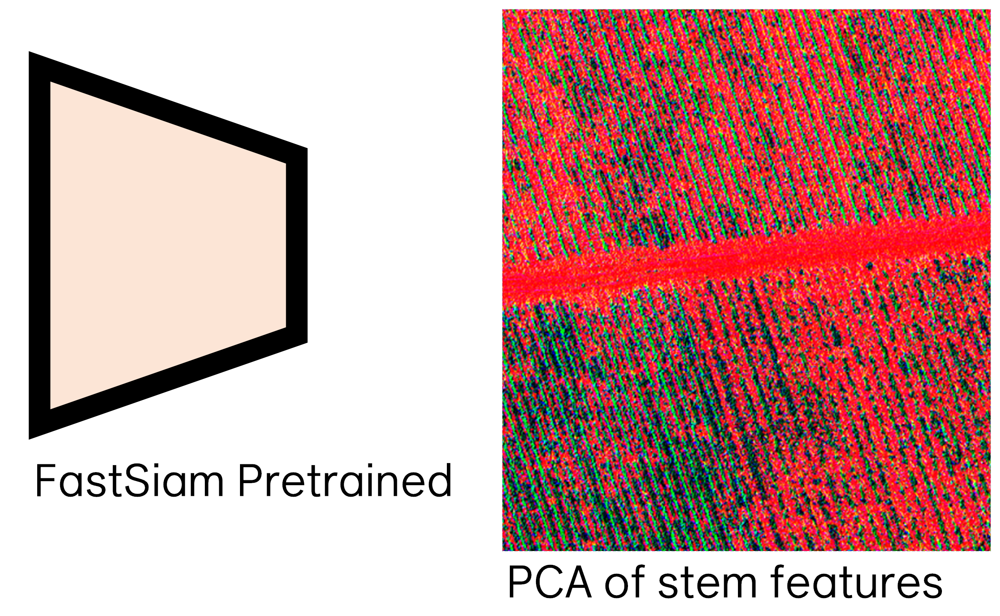
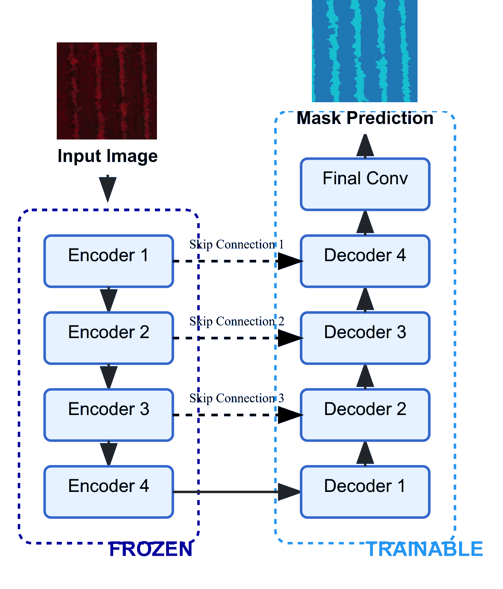

<div align="center">
  <p>
    <a href="https://icaerus.eu" target="_blank">
      </a>
    <h3 align="center">MultiSSL 🪅</h3>
    
   <p align="center">
    Learning on multispectral UAV imagery, using self supervised backbones and supervised tasks.
    <br/>
    <br/>
    <a href="https://github.com/icaerus-eu/uavgeo/wiki"><strong>Explore the wiki »</strong></a>
    <br/>
    <br/>
    <a href="https://github.com/icaerus-eu/uavgeo/issues">Report Bug</a>
    .
    <a href="https://github.com/icaerus-eu/uavgeo/issues">Request Feature</a>
  </p>
</p>
</div>

     

{width=800}

## Table Of Contents

* [Summary](#summary)
* [Features](#features)
  * [Self-Supervised Learning](#self-supervised-learning)
  * [Orthomosaic Processing](#orthomosaic-processing)
* [Installation](#installation)
* [Usage](#usage)
* [Model zoo](#model-zoo)
* [Contributing](#contributing)
* [License](#license)
  
## Summary
MultiSSL is a comprehensive library for self-supervised and semi-supervised learning targeting multi-spectral imagery. It provides implementations of modern representation learning methods specifically tailored for remote sensing and precision agriculture applications using UAVs.

The library builds upon PyTorch Lightning and LightlySSL to provide flexible, production-ready implementations of recent self-supervised learning algorithms. MultiSSL is designed to work with multi-channel data (RGB+NIR and beyond) and provides specialized data transformations and visualization tools for these data types.

## Features

### Self-Supervised Learning

{width=400}
MultiSSL implements several state-of-the-art self-supervised learning methods specially adapted for multi-spectral imagery:

- **FastSiam**: An efficient implementation of SimSiam with multi-view capabilities for multi-spectral imagery
- **Feature visualization**: Tools for visualizing learned representations including PCA-based feature visualization

### Orthomosaic Processing

{width=400}
Specialized tools for working with large orthomosaic imagery:

- **OrthoChipDataset**: Dataset Class for processing of orthomosaics + predictions in tiles
- **Prediction reconstruction**: Tools for reconstructing full orthomosaic predictions from individually processed tiles

### Semantic Segmentation Models

{width=400}
Lightning classes for Semantic segmentation based on the same backbones from FastSiam

- **SegmentationModel**: Using the backbone from Swin, or Resnet to build a UNet style decoder
- **RandomForestSegmentation**: RandomForest from sklearn for pixelwise predictions.

## Installation

```bash
# Clone the repository
git clone https://github.com/jurrians/multissl.git
cd multissl

# Install dependencies
pip install -e .

```

## Usage

Most useful code can be found under the `notebooks` folder. However, for pretraining using Self supervised, the `train.py` is your best bet. 

### Self-Supervised Pretraining

Data and Hardware Configuration

- input_dir: Required path to your dataset folder
- batch_size: 32 images per batch (default)
- num_workers: 4 parallel data loading processes (default)
- input_size: 224×224 pixel images (default)
- device: Uses CUDA if available, falls back to CPU

Model Architecture

- in_channels: 4 input channels (default, suitable for RGB+NIR data)
- backbone: Choice between resnet18 (default), resnet50, vit-s, or swin-tiny
- ssl_method: Self-supervised learning method - fastsiam (default), simclr, or simsiam
- num_views: 4 augmented views per image (default, with 3 target + 1 base recommended for FastSiam)

Network Architecture Details

- hidden_dim: 2048 neurons in hidden layers (default)
- proj_dim: 256-dimensional projection head output (default)
- pred_dim: 128-dimensional prediction head output (default)

Training Parameters

- epochs: 25 training epochs (default)
- lr: 0.02 base learning rate (default)
- momentum: 0.9 momentum for SGD optimizer (default)
- weight_decay: 1e-4 L2 regularization (default)
- save_every: Saves checkpoint every 1000 steps (default)

Reproducibility and Resuming

- seed: 42 random seed for reproducible results (default)
- checkpoint_path: Optional path to resume training from a checkpoint

The dataset_size parameter is automatically overridden during data loading with the actual dataset size, so you don't need to set it manually.

This can be used in a bash line for training a model:

```bash

# Training command
python multissl/train.py \
  --input_dir path/to/data \
  --batch_size 64 \
  --num_workers 8 \
  --input_size 224 \
  --in_channels 4 \
  --backbone resnet18 \
  --ssl_method fastsiam \
  --hidden_dim 2048 \
  --proj_dim 256 \
  --pred_dim 128 \
  --epochs 50 \
  --lr 0.05 \
  --momentum 0.9 \
  --weight_decay 1e-4 \
  --num_views 4 \
  --save_every 500 \
  --seed 42

```

### Fully supervised segmentation model training
This simplified code demonstrates how to train a segmentation model for aerial/satellite imagery using MultiSSL:

Configuration: First, we set up basic parameters including data paths, model architecture, and training settings.
Dataset: The SegmentationDataset class loads your multispectral images and corresponding masks. It handles 4-channel imagery and applies appropriate transformations.
Model Training: We use a pre-trained SegmentationModel with a Swin Transformer backbone. The model is trained using PyTorch Lightning, which handles the training loop, validation, and checkpoint saving.
Evaluation: After training, we load the best model and visualize its predictions on sample images. The visualize_predictions function creates a visualization showing the input image, ground truth mask, and model prediction.


```python
# 1. Basic Configuration
CONFIG = {
    # Paths
    "img_dir": "data/imgs",
    "mask_dir": "data/masks",
    # Model setup
    "pretrained_checkpoint": "checkpoints/swin-tiny-pretrained.ckpt", # if not filled it, will also train a backbone fully supervised
    "backbone_type": "swin-tiny",
    "in_channels": 4,  # RGBN channels
    "num_classes": 2,
    # Training parameters
    "batch_size": 4,
    "epochs": 50,
    "lr": 3e-4
}

# 2. Set up the dataset
import pytorch_lightning as pl
from torch.utils.data import DataLoader
from multissl.data import SegmentationDataset

train_dataset = SegmentationDataset(
    img_dir=CONFIG["img_dir"] + "/train",
    mask_dir=CONFIG["mask_dir"] + "/train",
    img_size=224
)

train_loader = DataLoader(
    train_dataset,
    batch_size=CONFIG["batch_size"],
    shuffle=True
)

# 3. Create and train the model
from multissl.models import SegmentationModel
from pytorch_lightning.callbacks import ModelCheckpoint

model = SegmentationModel(
    backbone_type=CONFIG["backbone_type"],
    pretrained_path=CONFIG["pretrained_checkpoint"],
    in_channels=CONFIG["in_channels"],
    num_classes=CONFIG["num_classes"]
)

checkpoint_callback = ModelCheckpoint(
    dirpath="checkpoints",
    filename="model-{epoch:02d}-{val_loss:.4f}",
    monitor="val_loss"
)

trainer = pl.Trainer(
    max_epochs=CONFIG["epochs"],
    accelerator="cuda",
    callbacks=[checkpoint_callback]
)

trainer.fit(model, train_loader)

# 4. Evaluate and visualize results
best_model = SegmentationModel.load_from_checkpoint(
    checkpoint_callback.best_model_path
)

from multissl.plotting.false_color import visualize_predictions
visualize_predictions(
    model=best_model,
    dataloader=train_loader,
    device="cuda",
    num_samples=2
)
```


### Processing large orthomosaics with MultiSSL
The pretrained and available models are used for 4 channel imagery: Red, Green,RedEdge, and NIR (in that order). In theory it could also be used for models with more or less channels.

```python

import xarray as xr
import rioxarray as rxr
import torch
from multissl.data import OrthoChipDataset
from multissl.eval.ortho_reconstruct import predict_ortho
from multissl.models import SegmentationModel  # or any other model type

# 1. Load your orthomosaic
ortho = rxr.open_rasterio("path/to/your/orthomosaic.tif") 

# Create an optional mask if you want to evaluate accuracy
# mask = rxr.open_rasterio("path/to/your/mask.tif")

# 2. Create dataset with orthomosaic chips
dataset = OrthoChipDataset(
    ortho=ortho,
    # mask=mask,  # Optional for evaluation
    img_size=(224, 224),  # Size of each chip
    remove_empty_chips=True,  # Filter out chips with no data (0 in all bands)
    empty_threshold=20.0,  # if chip contains more than threshold, drop the chip
)

print(f"Created dataset with {len(dataset)} chips")

# 3. Load your trained model
model = SegmentationModel.load_from_checkpoint("path/to/your/model.ckpt")
model.eval()  # Set to evaluation mode
device = torch.device("cuda" if torch.cuda.is_available() else "cpu")
model = model.to(device)

# 4. Process the orthomosaic and reconstruct full prediction
output_ortho = predict_ortho(
    model=model,
    ortho_dataset=dataset,
    ortho_template=ortho,
    batch_size=16,
    num_workers=4,
    device=device,
    output_channels=2  # For binary segmentation: 0 and 1  = background + 1 class = 2 channels
)

# 5. Save the output
output_ortho.rio.to_raster("path/to/output/prediction.tif")
```

## Model zoo

MultiSSL includes the following models:

- **Self-Supervised Models**
  - FastSiam: A multi-view contrastive learning model
    * Pretrained backbones:
    - [ResNet18 (11M param backbone)](https://e.pcloud.link/publink/show?code=kZREFqZ8514cPJqIjp9yuvOMwg2RS6Cyet7)
    - [SWIN-T Tiny (27.5M param backbone)](https://e.pcloud.link/publink/show?code=kZ4EFqZ5KNjg280mKmceWlLOq1VUS3o1Drk)

- **Segmentation Models**
  - SegmentationModel: Fully supervised segmentation model
  - RandomForestSegmentation: Efficient feature-based segmentation

## Contributing

Contributions are welcomed! Please feel free to submit a Pull Request.

1. Fork the repository
2. Create your feature branch (`git checkout -b feature/AmazingFeature`)
3. Commit your changes (`git commit -m 'Add some AmazingFeature'`)
4. Push to the branch (`git push origin feature/AmazingFeature`)
5. Open a Pull Request

## License

Distributed under the Apache License 2.0. See `LICENSE` for more information.

## Installation notes

https://docs.lightly.ai/self-supervised-learning/getting_started/install.html

```bash
mamba/conda create --name lightly python==3.9 
conda activate lightssl
```

Do a manual pytorch w/cuda install first (Lightly is compatible with PyTorch and PyTorch Lightning v2.0+!)

```bash
pip install torch torchvision torchaudio --index-url https://download.pytorch.org/whl/cu126
```

Then we are ready for lightly and we want tifffile for our more complex image files and cv2 for the data augments
```bash
pip install lightly tifffile opencv-python-headless wandb
```
